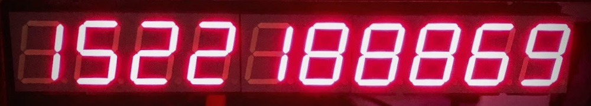

# Introduction

This project is a fork of [Maniacal Labs Super 7 Seg](https://github.com/ManiacalLabs/Super7Seg). Please refer to that project's README for the full details of that project.

My fork was designed with one project in mind - creating a [Unix Time Clock](https://mylifeasa.tinkerer.us/unix-time-clock-57b17d05442e). To accomplish this, I changed the [display hardware](https://github.com/dwaq/Super7Seg/tree/master/kicad/Super7Display) from 6x dual segment displays to 5x displays (12 digits to 10 digits) and changed the [controller hardware](https://github.com/dwaq/Super7Seg/tree/master/kicad/Super7Controller) from a ATMega328p to ESP32. The [Arduino firmware](https://github.com/dwaq/Super7Seg/tree/master/Firmware-ESP32) for this project is also in this repo, along with the [3D models](https://github.com/dwaq/Super7Seg/tree/master/Mount-ESP32) for mounting the project.